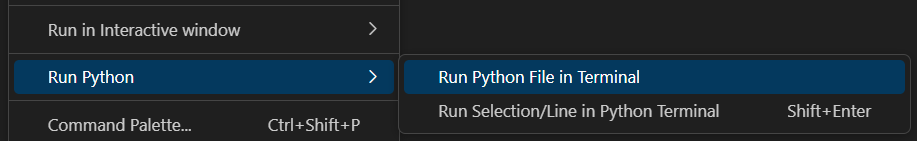
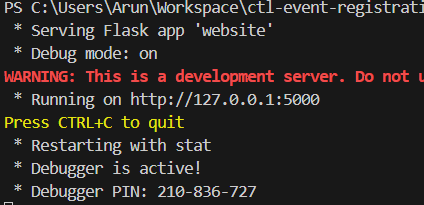

# ctl-event-registration
Event registration System

To setup the application on local system:

1. Make sure you have Mysql installed on your local machines
2. create a user "ctluser" with password as "admin"
3. create a DB schema "ctldb" in database
4. Make sure you have python installed on your machine
5. Make sure you have "pip" installed on your machine
6. download the dependencies for "flask" and "SqlAlchemy" using pip installer
7. you might also need to pip install "mysql-connector" and/or "mysql-connector-python"

Once above is staisfied you can open up the project in visual code. Go to the main.py file and right click on it
It should give you and option to run the python file in terminal. Select that option as shown below

If everything is setup correctly you should see the app running on localhost port 5000

Branching Strategy:

1. Always branch new feature branch off dev branch.
2. PR should always be from feature branch to dev branch.
3. PR should be reviewed before getting merged.
